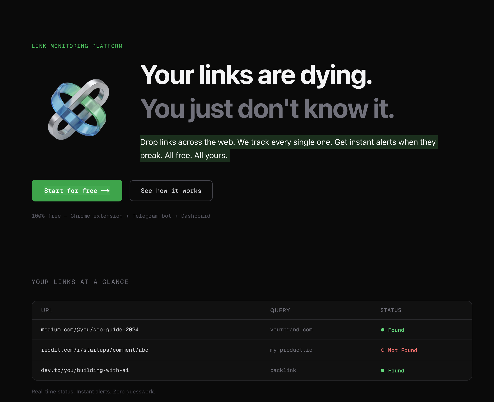

<div align="center">

# LookLinks — Link & Content Monitor

### Your personal SEO radar. Free. No middlemen. No bans.

[](https://developer.chrome.com/docs/extensions/develop/migrating/what-is-mv3)
[]()
[]()



</div>

---

## The Problem

You paid for backlinks — articles, comments, profiles. Invested real money. A week later, half of them are gone. Webmasters deleted articles, moderators cleaned up comments, links expired. And you didn't even know.

Paid monitoring services charge **$30–200/mo**, but they check from their own servers — websites see bots, block IPs, ban them. The result? False positives, missed links, and a hole in your budget.

## The Solution

**LookLinks** is a free Chrome extension that checks your backlinks the way a real person would. The browser opens the page in a background tab, searches for your text or link — and shows the result. No servers. No middlemen. No bans.

```
You → Chrome → Opens page → Searches text → Result
            ↑
      No third-party servers involved
```

## Key Advantages

| | Paid Services | **LookLinks** |
|---|---|---|
| Price | $30–200/mo | **Free forever** |
| Middlemen | Check from their servers | **You check yourself** |
| Ban risk | Service IPs on blacklists | **Your browser's IP** |
| Registration | Required | **Not needed** |
| Link limits | Capped by plan | **Unlimited** |
| Privacy | Your data on their servers | **Data stays in your browser** |

## Features

### Backlink Monitoring
Add a page URL and the text to look for (keyword, anchor text, domain). The extension checks and shows whether your content is still there.

### Flexible Queries
Search with plain text or regular expressions. Found "/seo.*2024/i" in an article — you'll see a green badge. Text gone — red.

### Automated Checks
Set up a schedule — daily, weekly, or monthly. The extension will go through all links with a configurable delay between checks (10 sec — 5 min) to avoid raising suspicion.

### Organization
- **Folders** — group links by projects, clients, campaigns
- **Tags** — label placement type: article, comment, profile, or custom
- **Filters** — quick filtering by domain, tag, status

### Bulk Import
Paste a list of URLs — all links are added with one click. Duplicates are filtered automatically.

### Export / Import
All data is stored locally in your browser. Export to a JSON file for backup. Import on another device.

### Dashboard Sync
Optionally — connect an API key and sync data with the web dashboard at [dash.looklinks.mom](https://dash.looklinks.mom) for access from any device.

### Bilingual Interface
English and Russian — switchable with one click.

## How It Works

```
1. Add a target: page URL + text to search for
2. Click "Run Check" or wait for the automatic schedule
3. The extension opens the page in a background tab
4. Searches for your text on the loaded page
5. Shows the result: FOUND / NOT FOUND
6. Closes the tab and moves to the next target
```

**Important:** The extension uses your real browser. Websites see a regular user, not a bot. No suspicious User-Agents, no data center IPs, no bans.

## Installation

### From Source (for developers)

1. Clone the repository:
```bash
git clone https://github.com/your-repo/plugin.git
cd plugin
```

2. Open Chrome and go to `chrome://extensions/`

3. Enable **Developer mode** (toggle in the top right corner)

4. Click **Load unpacked** and select the `plugin` folder

5. Done! Click the extension icon to open the dashboard

## Usage

### Quick Start

1. **Add your first target** — enter the donor URL, text to search for (anchor, keyword, or regex)
2. **Select tag and folder** — for convenient organization
3. **Click "Run Check Now"** — the extension will check all targets sequentially
4. **Monitor results** — green = link is alive, red = link is gone

### Regular Monitoring

1. Add all your links (use "Bulk Add" for large volumes)
2. In settings, select a schedule: daily / weekly / monthly
3. Set the delay between checks (1 minute recommended)
4. The extension will check links automatically in the background

### Query Examples

| Query Type | Example | Description |
|---|---|---|
| Plain text | `mybrand` | Find brand mentions |
| Link URL | `https://mysite.com` | Check for a specific link |
| Anchor text | `buy iphone` | Check link anchor text |
| Regex | `/nofollow.*mysite/i` | Detect if nofollow was added |
| Regex | `/<a.*href.*mysite.*rel=["']?nofollow/i` | Find links with nofollow in HTML |

## Who Is It For

- **SEO specialists** — monitor purchased links without overpaying for services
- **Webmasters** — track outgoing links from your sites
- **Marketers** — monitor brand mentions and publications
- **Freelancers** — prove link placement to clients
- **Agencies** — mass monitoring across multiple projects

## Technical Details

- **Manifest V3** — current Chrome Extension standard
- **Service Worker** — background checks even when dashboard is closed
- **chrome.scripting API** — search script injection into target pages
- **chrome.alarms API** — reliable check scheduling
- **chrome.storage.local** — all data stored locally
- **Retry mechanism** — automatic retry on page load failure
- **Zero dependencies** — pure vanilla JS, ~500 lines of code

## Project Structure

```
plugin/
├── manifest.json          # Manifest V3 configuration
├── background.js          # Service worker: queue, checks, scheduling
├── dashboard.html         # Dashboard UI
├── dashboard.js           # UI logic: filters, sorting, tables
├── i18n.js                # Internationalization (EN/RU)
├── styles.css             # Dashboard styles
├── utils/
│   └── storage.js         # Storage: CRUD targets, tags, folders, settings
└── icons/                 # Extension icons
```

## FAQ

**Q:** Can websites detect that I'm using the extension?
**A:** No. The extension opens pages as regular tabs. The website sees your standard browser and IP.

**Q:** How many links can I track?
**A:** Unlimited. Chrome storage can handle thousands of targets.

**Q:** Does the extension send my data anywhere?
**A:** No. All data is stored locally. Dashboard sync is optional and requires an explicit API key.

**Q:** Can I use it on multiple devices?
**A:** Yes, via JSON file export/import or web dashboard sync.

**Q:** Which browsers are supported?
**A:** Chrome and all Chromium-based browsers (Edge, Brave, Opera, Vivaldi, etc.).

---

<div align="center">

### Free. Forever. No middlemen. No bans.

**LookLinks** — because your links should work for you, not vanish silently.

</div>
